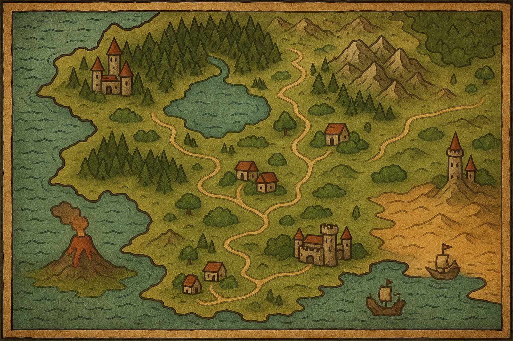
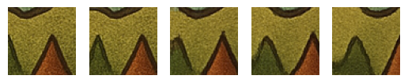
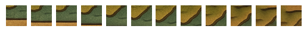
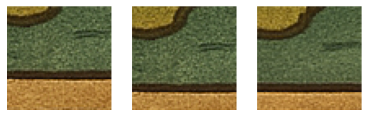
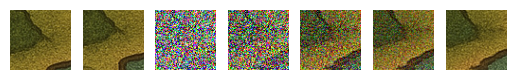
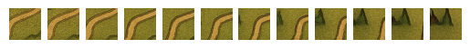
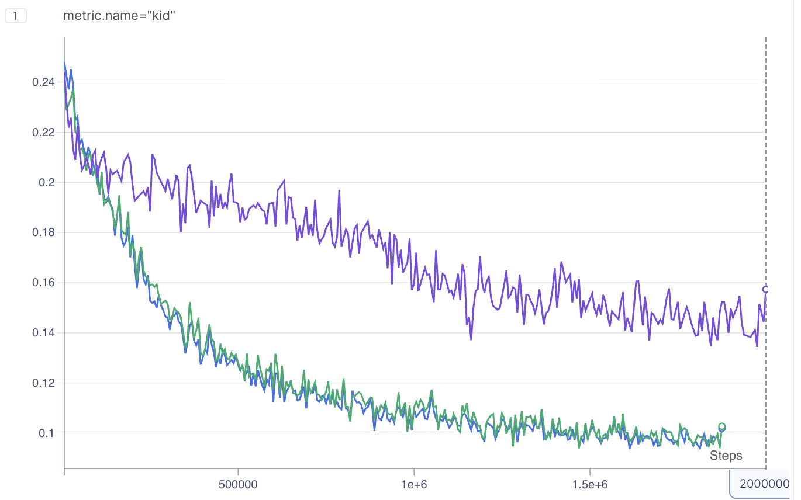

# WorldGen: An Action-Conditioned Flow Matching World Model for Visual Navigation

This repository documents an incremental research exploration of generative models for learning action-conditioned world dynamics from visual observations. The project progresses from basic image diffusion to action-conditioned world models using both DDPM and flow matching paradigms.

## Table of Contents

- [Research Problem](#research-problem)
- [Architecture Evolution](#architecture-evolution)
  - [Phase 1: Basic Diffusion Transformer (DiT)](#phase-1-basic-diffusion-transformer-dit)
  - [Phase 2: Normalization and Conditioning Improvements](#phase-2-normalization-and-conditioning-improvements)
  - [Phase 3: World Model with Action Conditioning](#phase-3-world-model-with-action-conditioning)
  - [Phase 4: Classifier-Free Guidance](#phase-4-classifier-free-guidance)
  - [Phase 5: Flow Matching](#phase-5-flow-matching)
- [Experimental Results](#experimental-results)
  - [Key Findings](#key-findings)
- [Sample Rollouts](#sample-rollouts)
- [Project Structure](#project-structure)
- [Usage](#usage)
- [Metrics](#metrics)
- [References](#references)

## Research Problem

Given an observation of a 2D world (a crop from a map) and a discrete navigation action (up/down/left/right), predict the next observation after taking that action. This is a simplified world model formulation that captures the essence of learning environment dynamics.

**Dataset**: Random 64x64 crops from a large world map image, with actions translating the crop by 8 pixels in the corresponding direction.



### Taking a tile and moving left


## Architecture Evolution

The model architecture evolved through several iterations, each addressing specific limitations discovered during experimentation.

### Phase 1: Basic Diffusion Transformer (DiT)

**Commits**: `b99d0d9` - `ed7e7db`

Initial implementation of a Diffusion Transformer for unconditional image generation:

- **Patchification**: 64x64 images split into 4x4 patches (256 patches total)
- **Transformer backbone**: Self-attention blocks with learned positional embeddings
- **Time conditioning**: Sinusoidal embeddings projected through MLP
- **DDPM training**: Cosine noise schedule with T=400 timesteps

```
Input Image -> Patchify -> Linear Proj + Pos Embed -> Transformer Blocks -> Unpatchify -> Output
                                    ^
                                    |
                              Time Embedding
```

### Phase 2: Normalization and Conditioning Improvements

**Commits**: `0ed68d6` - `eacc766`

Key architectural changes:

1. **LayerNorm to RMSNorm** (`0ed68d6`): Switched from LayerNorm to RMSNorm for improved training stability:
   ```python
   class RMSNorm(nn.Module):
       # x_norm = x / sqrt(mean(x^2) + eps) * weight
   ```

2. **FiLM Conditioning** (`eacc766`): Replaced additive time embedding with Feature-wise Linear Modulation:
   ```python
   class FiLM(nn.Module):
       # scale = 1 + gamma(cond), shift = beta(cond)
       # output = x * scale + shift
   ```
   This allows the conditioning signal to modulate both scale and shift of features.

3. **Dimension Increase** (`068ff3f`): Increased hidden dimension from 128 to 256 for greater model capacity.

### Phase 3: World Model with Action Conditioning

**Commits**: `6af6a0e` - `31c7943`

Extended the DiT architecture to WorldDiT for action-conditioned prediction:

```
                    +-- Time Embed --+
                    |                |
Start Image -> Vision Encoder -------+-> Concat -> Project -> FiLM Conditioning
                    |                |
Action -> Action Embed --------------+

Noised End Image -> Patchify -> Transformer Blocks (with conditioning) -> Predicted Noise
```

**Key components**:

- **VisionEncoder**: CNN-based encoder (3 conv blocks with maxpool) to extract start state features
- **Action Embedding**: MLP to embed discrete actions (0-3) into conditioning space
- **Conditioning Fusion**: Concatenate [time, start_embed, action_embed] and project to hidden dim
- **FiLM in Transformer**: Apply FiLM conditioning after each normalization layer

### Phase 4: Classifier-Free Guidance

**Commit**: `8f86034`

Added CFG support for improved sample quality:

```python
if enable_cfg:
    # During training: randomly drop conditioning 10% of the time
    if random() < cond_dropout:
        starts = null_start  # learned null embedding
        actions = null_action

    # During inference: interpolate between conditional and unconditional
    eps_cond = model(x_t, t, start, action, cfg=False)
    eps_uncond = model(x_t, t, start, action, cfg=True)
    eps = eps_uncond + cfg_scale * (eps_cond - eps_uncond)
```

### Phase 5: Flow Matching

**Commits**: `30f8405` - `ac32500`

Replaced DDPM with flow matching for faster sampling:

**Key differences from DDPM**:
- **No noise schedule**: Direct interpolation between noise and data
- **Velocity prediction**: Model predicts velocity v = x1 - x0 instead of noise
- **ODE sampling**: Simple Euler integration with ~10 steps vs 100+ for DDPM

```python
# Training
x0 = randn_like(x1)  # pure noise
t = rand(B)          # uniform [0, 1]
xt = x0 + (x1 - x0) * t  # linear interpolation
v = x1 - x0          # target velocity
v_pred = model(xt, t, start, action)
loss = MSE(v_pred, v)

# Sampling (Euler method)
for t in linspace(0, 1, num_steps):
    v = model(x, t, start, action)
    x = x + v * dt
```

**CFG with flow matching**:
```python
v_cond = model(x, t, start, action, cfg=False)
v_uncond = model(x, t, start, action, cfg=True)
v = v_uncond + cfg_scale * (v_cond - v_uncond)
```

## Experimental Results

Results from training runs (batch_size=16, lr=1e-4, dim=256):

| Run | Experiment | Duration | Training Loss | Eval Loss | KID |
|-----|------------|----------|---------------|-----------|-----|
| world_flow_clsfg | world_flow + CFG | 3h 17m | 0.200 | 0.089 | **0.102** |
| world_flow_base | world_flow | 3h 44m | 0.197 | 0.089 | 0.103 |
| world_clsfg | world_model + CFG | 7h 20m | 0.061 | 0.010 | 0.129 |
| world_filmcond_pre | world_model (pretrain) | 3h 34m | 0.049 | 0.007 | 0.106 |
| world_filmcond | world_model | 3h 35m | 0.050 | 0.007 | 0.128 |
| world_base | world_model | 2h 2m | 0.040 | 0.007 | 0.157 |
| diffusion_dim256 | diffusion | 4h 39m | 0.048 | 0.008 | 0.174 |
| diffusion_base | diffusion | 6h 13m | 0.073 | 0.009 | 0.178 |

### Key Findings

1. **Flow matching achieves comparable KID with 10x fewer sampling steps** (10 vs 100)

2. **FiLM conditioning in transformer blocks outperforms additive conditioning**

3. **Pretraining on unconditional generation helps** - world_filmcond_pre achieved lower KID than training from scratch

4. **CFG provides modest improvement** - best KID of 0.102 with flow matching + CFG

5. **World models have lower training loss but higher KID than unconditional diffusion** - suggests the conditioning helps fit the data but may limit diversity

## Sample Rollouts

<!-- TODO: Add rollout images -->

<p align="center">
  
  <br>
  <i><span style="color: gray;">Figure 1: Multi-step rollout showing navigation through the world map</span></i>
</p>

<p align="center">
  
  <br>
  <i><span style="color: gray;">Figure 2: Original | Ground Truth (moved down) | Generated</span></i>
</p>

<p align="center">
  
  <br>
  <i><span style="color: gray;">Figure 3: DDIM denoising process visualization at different timesteps</span></i>
</p>

<p align="center">
  
  <br>
  <i><span style="color: gray;">Figure 4: Flow matching rollout trajectory</span></i>
</p>

<p align="center">
  
  <br>
  <i><span style="color: gray;">Figure 5: KID metric: Flow matching vs DDIM</span></i>
</p>

## Project Structure

```
worldgen/
 models/
    dit.py           # Base Diffusion Transformer
    world_dit.py     # Action-conditioned World DiT
    transformer.py   # Transformer block with FiLM
    film.py          # Feature-wise Linear Modulation
    rms_norm.py      # RMSNorm implementation
    vision_encoder.py # CNN encoder for start state
 train/
    diffusion/       # DDPM training and sampling
    world/           # World model (DDPM) training
    world_flow/      # Flow matching training
    metrics.py       # KID metric computation
    utils.py         # Visualization utilities
 dataset.py           # World map dataset with actions
 train.py             # Main training script
 assets/              # Experiment logs and images
```

## Usage

```bash
# Train diffusion model (unconditional)
python train.py --experiment diffusion

# Train world model (DDPM)
python train.py --experiment world

# Train world model (flow matching + CFG)
python train.py --experiment world_flow

# Continue from pretrained
python train.py --experiment world --pretrained --pretrained_path checkpoints/model.pth
```

## Metrics

**Kernel Inception Distance (KID)**: Measures distribution similarity between real and generated images using polynomial kernel MMD on Inception-v3 features. Lower is better. Preferred over FID for small sample sizes as it provides an unbiased estimate.

## References

- [Scalable Diffusion Models with Transformers (DiT)](https://arxiv.org/abs/2212.09748)
- [FiLM: Visual Reasoning with a General Conditioning Layer](https://arxiv.org/abs/1709.07871)
- [Flow Matching for Generative Modeling](https://arxiv.org/abs/2210.02747)
- [Classifier-Free Diffusion Guidance](https://arxiv.org/abs/2207.12598)

---

*Experiments tracked with [Aim](https://aimstack.io/)*
